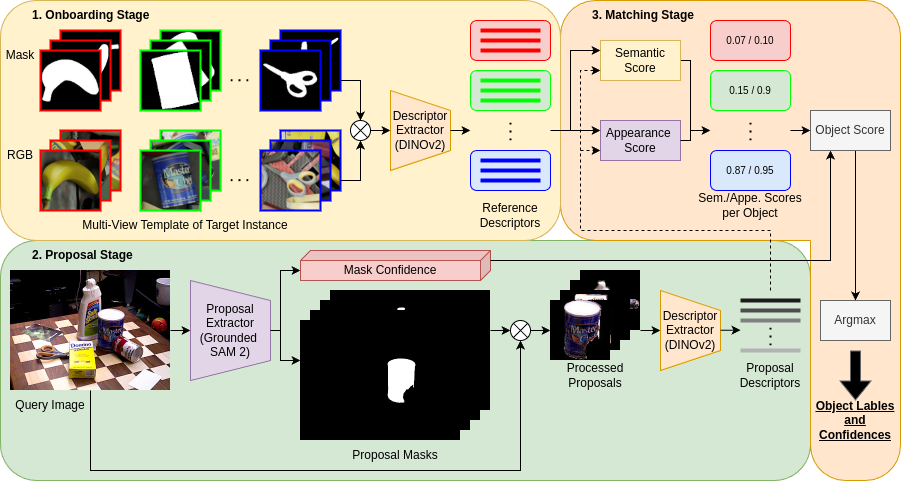
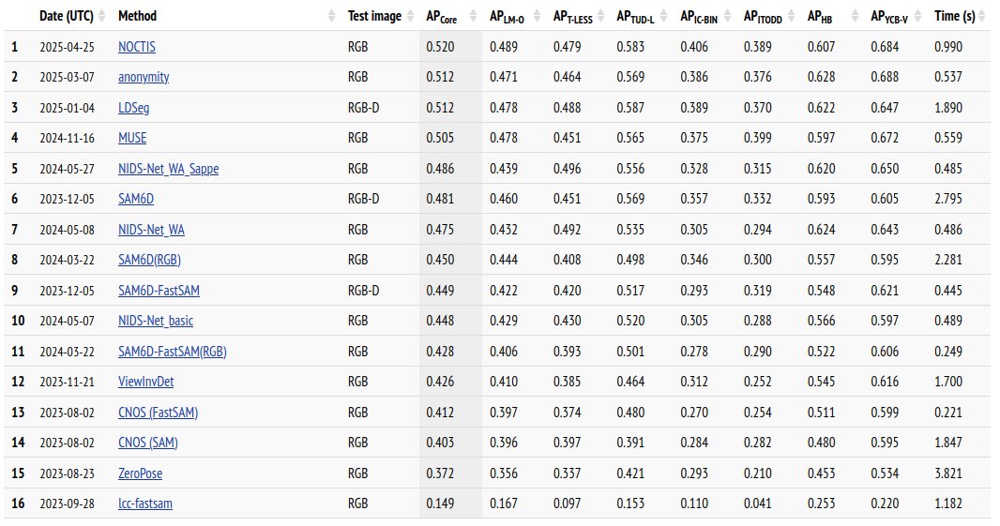

# NOCTIS: Novel Object Cyclic Threshold based Instance Segmentation

This is the official implementation of our [[Paper]](https://arxiv.org/abs/2507.01463).

Contributors: Max Gandyra, Alessandro Santonicola, Michael Beetz

Instance segmentation of novel objects instances in RGB images, given some example images for each object, is a well known problem in computer vision. Designing a model general enough to be employed for all kinds of novel objects without (re-) training has proven to be a difficult task. To handle this, we present a new training-free framework, called: Novel Object Cyclic Threshold based Instance Segmentation (NOCTIS). NOCTIS integrates two pre-trained models: Grounded-SAM 2 for object proposals with precise bounding boxes and corresponding segmentation masks; and DINOv2 for robust class and patch embeddings, due to its zero-shot capabilities. Internally, the proposal-object matching is realized by determining an object matching score based on the similarity of the class embeddings and the average maximum similarity of the patch embeddings with a new cyclic thresholding (CT) mechanism that mitigates unstable matches caused by repetitive textures or visually similar patterns. Beyond CT, NOCTIS introduces: (i) an appearance score that is unaffected by object selection bias; (ii) the usage of the average confidence of the proposals’ bounding box and mask as a scoring component; and (iii) an RGB-only pipeline that performs even better than RGB-D ones. We empirically show that NOCTIS, without further training/fine tuning, outperforms the best RGB and RGB-D methods regarding the mean AP score on the seven core datasets of the BOP 2023 challenge for the “Model-based 2D segmentation of unseen objects” task.



**Best method on the world-wide [BOP leaderboard](https://bop.felk.cvut.cz/leaderboards/segmentation-unseen-bop23/bop-classic-core/) (as of 2025/04) for model-based novel object instance segmentation.**




##  Installation

<details><summary>Click to expand</summary>


Open a console/terminal in the "noctis" dir.

Note: Commands tested with Ubuntu 20.04 LTS (Focal Fossa), Python 3.8 and Pytorch 2.2.1 (CUDA 11.8).


### 1. Package Installation

(Optional) Create a new virtual environment using "virtualenvwrapper":

```
mkvirtualenv noctis_env
```

(Optional) Switch to it, if not already active:

```
workon noctis_env
```

Install all packages by executing the following commands:

```
pip3 install -U torch==2.2.1 torchvision==0.17.1 torchaudio==2.2.1 xformers==0.0.25 --index-url https://download.pytorch.org/whl/cu118
pip3 install -U -r requirements.txt
pip3 install -U git+https://github.com/facebookresearch/segment-anything.git
pip3 install -U git+https://github.com/ChaoningZhang/MobileSAM
pip3 install -U git+https://github.com/facebookresearch/detectron2.git
pip3 install -U git+https://github.com/IDEA-Research/GroundingDINO.git
```


### 2. Download BOP Challenge 2023 Datasets

Download all the seven core datasets of the BOP Challenge 2023 (LM-O, T-LESS, TUD-L, IC-BIN, HB, YCB-V), using the provided script:

```
python scripts/download_bop23.py
```

Note: One can also download only a specific dataset, e.g. for YCB-V, with:

```
python scripts/download_bop23.py dataset_name=ycbv
```

The datasets in the dir ```./datasets/datasets``` should now have the following structure
```
DATASET_NAME
├─ camera[_CAMTYPE].json
├─ dataset_info.json
├─ test_targets_bop19.json
├─ models
│  ├─models[_MODELTYPE][_eval]
│  │  ├─ models_info.json
│  │  ├─ obj_OBJ_ID.ply
├─ train|test[_SPLITTYPE]
│  ├─ SCENE_ID|OBJ_ID
│  │  ├─ scene_camera[_CAMTYPE].json
│  │  ├─ scene_gt[_CAMTYPE]son
│  │  ├─ scene_gt_info[_CAMTYPE].json
│  │  ├─ depth[_CAMTYPE]
│  │  ├─ mask[_CAMTYPE]
│  │  ├─ mask_visib[_CAMTYPE]
│  │  ├─ rgb|gray[_CAMTYPE]
```
See also the [BOP toolkit](https://github.com/thodan/bop_toolkit/blob/master/docs/bop_datasets_format.md?plain=1), for the dataset definition.


### 3. Templates creation


#### 3.1. Rendering templates

To render the templates one can either use [Pyrender](https://github.com/mmatl/pyrender) or [BlenderProc](https://github.com/DLR-RM/BlenderProc).
Pyrender is lightweight and fast, thus, it only needs a few minutes to render all datasets' templates.
Execute:

```
python -m scripts.render_bop_template renderer=pyrender
```

to create and store all templates in the dir ```./datasets/datasets/templates```.
Note: One can also render only a specific dataset, e.g. for YCB-V, with:

```
python -m scripts.render_bop_template renderer=pyrender dataset_name=ycbv
```

BlenderProc is a much heavier, but photorealistic renderer, which takes multiple hours to finish with all datasets. 
Note: As this needs to be done only once, the improvement in quality is worth it.
Note: Execute ```blenderproc quickstart``` to finish its installation.
Execute:

```
python -m scripts.render_bop_template renderer=blenderproc template_dir=templates_blender
```

to create and store all templates in the dir ```./datasets/datasets/templates_blender```.

Note: One can also render only a specific dataset, e.g. for YCB-V, with:

```
python -m scripts.render_bop_template renderer=blenderproc template_dir=templates_blender dataset_name=ycbv
```

Note: The BlenderProc templates are stored in another dir, rather than the Pyrender ones, so that it can be specified later which to use.


#### 3.2. Download BlenderProc4BOP training data

For the best results, one needs to use the pre-rendered BlenderProc4BOP renders of the seven core datasets from the BOP Challenge 2023.
Use the provided script to download them:

```
python scripts/download_pbr_train_bop23.py
```

Note: One can also download only the PBR trainings data of a specific dataset, e.g. for YCB-V, with:

```
python scripts/download_pbr_train_bop23.py dataset_name=ycbv
```

**Warning**: These files are extremely large (~25GB), be sure, beforehand, that one needs/wants to use them.


### 4. Download model weights and checkpoints

Download the DINOv2, Grounding-DINO, SAM, MobileSAM model checkpoints using the provided script:

```
python scripts/download_sub_model_checkpoints.py
```


</details>


## Test on BOP 2023 Datasets

<details><summary>Click to expand</summary>

After having downloaded and installed everything, some testing can be done.


### Paper Tests

To execute the paper test, take first a look at the file ```./scripts/test_configs/test.json```, it contains the configurations in JSON format used in the paper.
Each configuration has a key/name followed by a list of key-value pairs to overwrite the default values encoded as strings.
For example, to run the configuration "cnos2AppCT5ConfGBSAM21LPbrMode" (the best one) on all the seven core datasets, execute:

```
python scripts/run_bop23_tests.py -d "icbin" "lmo" "tless" "tudl" "itodd" "hb" "ycbv" -p "save_dir='./datasets/results/noctis'" -r "./scripts/test_configs/test.json" -e -m "cnos2AppCT5ConfGBSAM21LPbrMode"
```

The results are stored in the dir ```./datsets/results/noctis```. 
To evaluate them, ether use the [BOP Toolkit](https://github.com/thodan/bop_toolkit) and follow the instruction in section 6, or the online evaluation system of the [BOP Home Page](https://bop.felk.cvut.cz/home/).

A list of all the possible configurations' names: 
> cnosGBSAM21LPyrenderMode, cnosGBSAM21LPbrMode, appGBSAM21LPbrMode, cnosConfGBSAM21LPbrMode, cnosAppGBSAM21LPbrMode, cnos2AppGBSAM21LPbrMode, cnos3AppGBSAM21LPbrMode, cnos4AppGBSAM21LPbrMode, cnosAppConfGBSAM21LPbrMode, cnos2AppConfGBSAM21LPbrMode, cnos3AppConfGBSAM21LPbrMode, cnos4AppConfGBSAM21LPbrMode, cnosAppCT5ConfGBSAM21LPbrMode, cnos2AppCT5ConfGBSAM21LPbrMode, cnos3AppCT5ConfGBSAM21LPbrMode, cnos4AppCT5ConfGBSAM21LPbrMode, cnos2AppCT0ConfGBSAM21LPbrMode, cnos2AppCT1ConfGBSAM21LPbrMode, cnos2AppCT2ConfGBSAM21LPbrMode, cnos2AppCT3ConfGBSAM21LPbrMode, cnos2AppCT4ConfGBSAM21LPbrMode, cnos2AppCT6ConfGBSAM21LPbrMode, cnos2AppCT7ConfGBSAM21LPbrMode, cnos2AppCT8ConfGBSAM21LPbrMode, cnos2AppCT5ConfGBSAMHPbrMode, cnos2AppCT5ConfGBSAM21LPyrenderMode, cnos2AppCT5ConfGBSAM21LBlenderMode


### Run your own tests

Besides using the pre-defined configurations, one can also run his/her own tests.
For example, calling:

```
python -m scripts.run_inference dataset_name=ycbv model.name_prediction_file=cnosPyrenderMode_ycbv-test model.matching_config.appearance_score_weight_factor=0.0  model.matching_config.use_detector_confidence=False name_exp=cnosMode
```

runs the test on the YCB-V dataset, while using Pyrender, "normal" Grounded-SAM with only the semantic score; then, stores the result as the file ```./datsets/results/cnos/cnosPyrenderMode_ycbv-test.json```.
To visualize the previous result, execute:

```
python -m scripts.visualize_detectron2 -i "./datasets/results/cnosMode/cnosPyrenderMode_ycbv-test.json" -d "./datasets/datasets/ycbv" -b "gray" -o "./datasets/results/cnosMode/vis_det/"
```

then, one can take a look at the created images in the dir ```./datasets/results/cnosMode/vis_det```.


### Run with a USB camera/video as input source

Despite using only the images provided by BOP 2023 Datasets, one can also segment custom images provided by a USB camera/video and visualize the results immediately through calling:

```
python -m scripts.run_inference_from_opencv_camera -i 0 -p "dataset_name=ycbv model.matching_config.semantic_score_weight_factor=1.0 model.matching_config.appearance_score_weight_factor=0.0 model.matching_config.use_detector_confidence=False" -b "gray"
```

Note: The results are not saved. This file is more of a demo about how to use the detector 'outside' of the BOP challenge data structure.

</details>


## Memory problems

If one gets a ```CUDA out of memory```-error, there are multiple ways to reduce the memory usage:
  - Change the configuration value ```num_workers``` in ```./configs/machine/local.yaml``` from 4 to 0.
  - Change the default value of the function arguments ```chunk_size``` and ```obj_chunk_size``` of the function ```src.model.scoring.compute_appearance_similarity``` to smaller a value, e.g. set ```chunk_size``` to 8.
    **Warning**: Changing these values causes a tradeoff between reduced CUDA memory consumption and increased computation time.


## Bibtex

```latex
@misc{gandyra2025noctisnovelobjectcyclic,
      title={NOCTIS: Novel Object Cyclic Threshold based Instance Segmentation}, 
      author={Max Gandyra and Alessandro Santonicola and Michael Beetz},
      year={2025},
      eprint={2507.01463},
      archivePrefix={arXiv},
      primaryClass={cs.CV},
      url={https://arxiv.org/abs/2507.01463}, 
}
```


## Acknowledgements

The code is based on [CNOS](https://github.com/nv-nguyen/cnos), [SAM-6D](https://github.com/JiehongLin/SAM-6D/tree/main) and [NIDS-Net](https://github.com/YoungSean/NIDS-Net)

